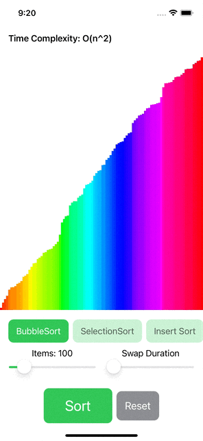
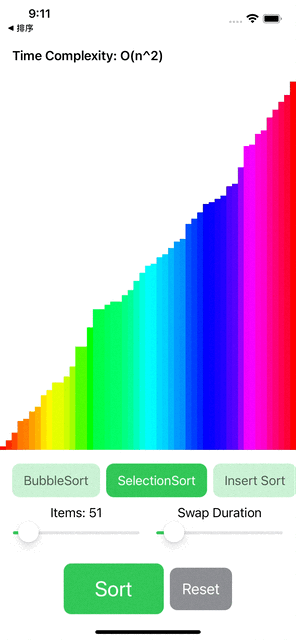
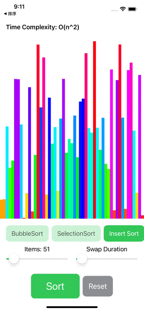
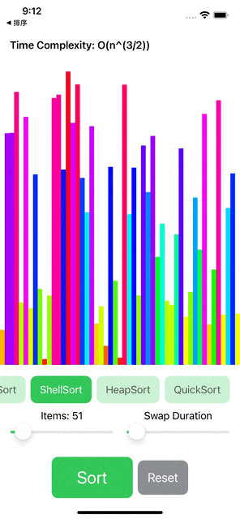
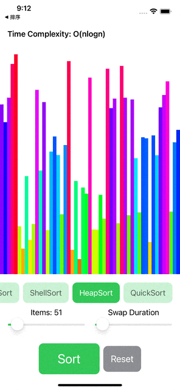
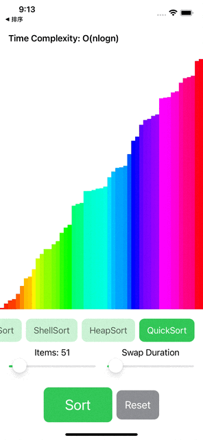

# SwiftUI - WeatherForecast
<br />

| 1. Bubble Sort  | 2. Selection Sort | 3. Insert Sort|
| ------------- | ------------- | ------------- | 
|  |  |  |

| 4. Shell Sort  | 5. Heap Sort | 6. Quick Sort|
| ------------- | ------------- | ------------- | 
|  |  |  |

The sorting algorithms visualization project which contains 6 different algorithms.
In the chart the red rectangle is the larger number and the yellow and orange is smaller number

## Features

- [x] Bubble Sort
- [x] Selection Sort
- [x] Insert Sort
- [x] Shell Sort
- [x] Heap Sort
- [x] Quick Sort


## Requirements

- iOS 13.0+
- SwiftUI

## Installation

Clone the project and run in your local workstation. 

## Algorithms Explaination

1. Bubble Sort
```swift
/// BubbleSort：Time Complexity----O(n^2)
struct BubbleSort: SortType {
    
    var timeComplexity: String = "O(n^2)"
    
    var name: String = "BubbleSort"
    
    func sort(items: [RectData]) -> [SwapData] {
        var list = items
        var swaps = [SwapData]()
        
        for i in 0..<list.count {
            var j = list.count - 1
            while j > i {
                if list[j - 1] > list[j]  { //If the previous one bigger than next value, exchange the position
                    let temp = list[j]
                    list[j] = list[j - 1]
                    list[j - 1] = temp
                    swaps.append(SwapData(fromIndex: j-1, toIndex: j))
                }
                j = j - 1
            }
        }
        
        return swaps
    }
}
 ```
2. Insert Sort
```swift
/// InsertSort : Time Complexity - O(n^2)
struct InsertSort: SortType{
    
    var timeComplexity: String = "O(n^2)"
    
    var name: String = "Insert Sort"
    
    func sort(items: [RectData]) -> [SwapData] {
        
        var swaps = [SwapData]()
        
        //print("InsertSort")
        var list = items
        
        for i in 1..<list.count {
            //print("The \(i) round insertion：")
            //print("The chosen value is ：\(list[i].value)")
            var j = i
            while j > 0 {           //Loop through the list then insert the value.
                if list[j] < list[j - 1]  {
                    
                    let temp = list[j]
                    list[j] = list[j-1]
                    list[j-1] = temp
                    
                    swaps.append(SwapData(fromIndex: j-1, toIndex: j))
                    
                    j = j - 1
                } else {
                    break
                }
            }
            print("The position is ：\(j)")
            print("This round is finished, the results are：\n\(list.map{$0.value})\n")
        }
        
        return swaps
    }
}
 ```
 
3. Selection Sort
```swift
/// SimpleSelection Sort  : Time Complexity - O(n^2)
struct SimpleSelectionSort:  SortType {
    
    var timeComplexity: String = "O(n^2)"
    var name: String = "SelectionSort"
    var swaps = [SwapData]()
    
    mutating func sort(items: [RectData]) -> [SwapData] {
        swaps.removeAll()
        
        //print("Simple Selection Sort")
        var list = items
        for i in 0..<list.count {
            print("The \(i+1) round choose, the rang is between \(i) to \(list.count)")
            var j = i + 1
            var minValue = list[i]
            var minIndex = i
            
            //To find the minmium value
            while j < list.count {
                if minValue > list[j] {
                    minValue = list[j]
                    minIndex = j
                }
                
                j = j + 1
            }
            
            print("In the second half unoder list, the minimium value is \(minValue.value), index = \(minIndex)")
            
            if minIndex != i {
                print("\(minValue) and \(list[i].value) exchange the position")
                let temp = list[i]
                list[i] = list[minIndex]
                list[minIndex] = temp
                
                swaps.append(SwapData(fromIndex: minIndex, toIndex: i))
                
            }
            print("The result of this round is : \(list.map{$0.value})\n")
        }
        
        return swaps
    }
}

 ```
4. Heap Sort
```swift
/// Heap Sort : Time Complexity -  (O(nlogn))
struct HeapSort: SortType {
    var timeComplexity: String = "O(nlogn)"
    var name: String = "HeapSort"
    var swaps = [SwapData]()
    
    mutating func sort(items: [RectData]) -> [SwapData] {
        
        swaps.removeAll()

        var list = items
        var endIndex = items.count - 1
        
        heapCreate(items: &list)
        
        print("Oringinal List：\(list.map {$0.value})")
        while endIndex >= 0 {
            
            print("list[0]:\(list[0].value) swap with list[\(endIndex)]:\(list[endIndex].value)")
            
            let temp = list[0]
            list[0] = list[endIndex]
            list[endIndex] = temp
            
            swaps.append(SwapData(fromIndex: endIndex, toIndex: 0))
            
            endIndex -= 1   //Reduce the range of the heap
            
            //After change the position, adjust the heap and create the new heap.
            heapAdjast(items: &list, startIndex: 0,endIndex: endIndex + 1)
            print("After adjust :\(list.map {$0.value})\n")
        }
        
        return swaps
    }
    
    mutating func heapCreate(items: inout [RectData]) {
        var i = items.count
        while i > 0 {
            heapAdjast(items: &items, startIndex: i - 1, endIndex:items.count )
            i -= 1
        }
    }
    
    mutating func heapAdjast(items: inout [RectData], startIndex: Int, endIndex: Int) {
        let temp = items[startIndex]
        var fatherIndex = startIndex + 1                 //Father index
        var maxChildIndex = 2 * fatherIndex //Left children's index
        while maxChildIndex <= endIndex {
            //Compare left and right children and find the child with the greater value
            if maxChildIndex < endIndex && items[maxChildIndex-1] < items[maxChildIndex] {
                maxChildIndex = maxChildIndex + 1
            }
            
            //If the branch node is greater than root, set the value to the root.
            if temp < items[maxChildIndex-1] {
                items[fatherIndex-1] = items[maxChildIndex-1]
                swaps.append(SwapData(fromIndex: fatherIndex-1, toIndex: maxChildIndex-1))
            } else {
                break
            }
            fatherIndex = maxChildIndex
            maxChildIndex = 2 * fatherIndex
        }
        items[fatherIndex-1] = temp
        
    }
    
}

```

5. Shell Sort
```swift
///ShellSort：Time Complexity - O(n^(3/2))
struct ShellSort: SortType {
    var timeComplexity: String = "O(n^(3/2))"
    
    var name: String = "ShellSort"
    
    func sort(items: [RectData]) -> [SwapData] {
        var swaps = [SwapData]()
        
        //print("ShellSort begin")
        var list = items
        var step: Int = list.count / 2
        while step > 0 {
            print("Start the insert and the step is \(step)：")
            for i in 0..<list.count {
                var j = i + step
                while j >= step && j < list.count {
                    if list[j] < list[j - step]  {
                        let temp = list[j]
                        list[j] = list[j-step]
                        list[j-step] = temp
                        swaps.append(SwapData(fromIndex: j-step, toIndex: j))
                        j = j - step
                    } else {
                        break
                    }
                }
            }
            print("The step of \(step) sorting end.")
            print("This round result is: \(list.map{$0.value})\n")
            step = step / 2     //Reduce the step
        }
        
        return swaps
    }
}

```

6. Quick Sort
```swift
/// Quick Sort - Time Complexity O(nlogn)
struct QuickSort: SortType {
    
    var timeComplexity: String = "O(nlogn)"
    var name: String = "QuickSort"
    var swaps = [SwapData]()
    
    mutating func sort(items: [RectData]) -> [SwapData] {
        
        swaps.removeAll()
        
        var list = items
        //print("Start Quick Sort")
        quickSort(list: &list, low: 0, high: list.count-1)
        //print("End of Quick Sort")
        
        return swaps
    }
    
    private mutating func quickSort(list: inout Array<RectData>, low: Int, high: Int) {
        if low < high {
            let mid = partition(list: &list, low: low, high: high)
            quickSort(list: &list, low: low, high: mid - 1)
            quickSort(list: &list, low: mid + 1, high: high)
        }
    }

    private mutating func partition(list: inout Array<RectData>, low: Int, high: Int) -> Int {
        var low = low
        var high = high
        let temp = list[low]
        
        while low < high {

            while low < high && list[high] >= temp {
                high -= 1
            }
            list[low] = list[high]
            swaps.append(SwapData(fromIndex: low, toIndex: high))

            while low < high && list[low] <= temp {
                low += 1
            }
            list[high] = list[low]
            swaps.append(SwapData(fromIndex: high, toIndex: low))
            
        }
        list[low] = temp

        return low
    }
}
```


## Acknowledgements and Credits
- This project was inspired by [Instagram - Haipp](https://www.instagram.com/p/COdA_nPtqtl/?utm_source=ig_web_copy_link)
- [Zelu Li - Github](https://github.com/lizelu)


## Contact
Created by [@Hung-Chun, Tsai (Carter)](linkedin.com/in/hung-chun-carter-tsai-372584175) - feel free to contact me!

<div>

<i>Follow me around the web:</i><br>

<!-- <a target="_blank" href="https://www.linkedin.com/in/hung-chun-carter-tsai-372584175/">🇱​🇮​🇳​🇰​🇪​🇩​🇮​🇳​</a> ●
<a target="_blank" href="https://www.instagram.com/hungchun.tsai/">🇮​🇳​🇸​🇹​🇦​🇬​🇷​🇦​🇲​</a> ●
<a target="_blank" href="https://www.facebook.com/hongjun.cai.5">🇫​🇦​🇨​🇪​🇧​🇴​🇴​🇰​</a> ● -->

<a href="https://www.linkedin.com/in/hung-chun-carter-tsai-372584175/" target="_blank"></a>
<a href="https://www.instagram.com/hungchun.tsai/" target="_blank"></a>
<a href="https://www.facebook.com/hongjun.cai.5" target="_blank"></a>

</div>
